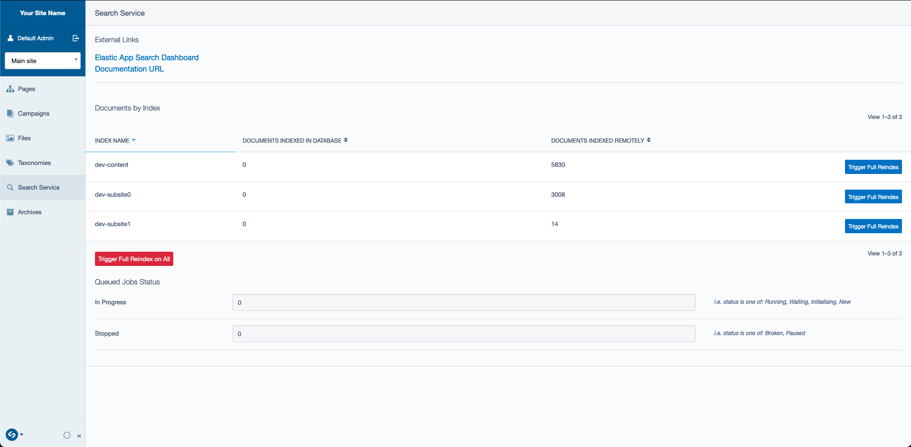

# Usage

For most cases, DataObject based content should index with configuration only,
but there are some important concepts to understand about what is happening internally
and how to manage your index with so much activity happening implicitly through content
changes.

## CMS Admin

For admin users and other users with the `CMS_ACCESS_SearchAdmin` permission, there will be a
Left and Main "dashboard" labelled "Search Service" available. This contains data about objects
that are indexed, links to documentation and other resources, and the ability to trigger a
reindex (with `ADMIN` permissions).



See `IndexingInterface` for how these external links are configured for your implementation.

## Pages and other DataObjects

Publish and unpublish events will instantiate an `IndexJob`, described below. If the
`use_sync_jobs` setting is on, it will be viewable in the index upon completion of the
network request. This setting is not recommended for production, however, and therefore
you may have a slight delay between saving the content and seeing it in the index depending
on how your jobs are set up (more information below).

## Jobs

All jobs are configured to be run immediately. (`QueuedJob::IMMEDIATE`). For more information
on setting up immediate execution of jobs, see the [QueuedJobs documentation](https://github.com/symbiote/silverstripe-queuedjobs#using-queuedjobimmediate-jobs).

There are several jobs that come with this module:

* `IndexJob`: This job is responsible for indexing one or many documents and removing documents
if they are determined to be invisible to the index (e.g. a false `shouldIndex()` check). It will
also reindex dependent documents if you have the `auto_depdendency_tracking` enabled. (See [Dependency tracking](#dependency-tracking))

* `ClearIndexJob`: Clear an entire index. May run for a long time, as this job does not use any
concurrency.

* `ReindexJob`: Reindex all documents. Does not do any dependency tracking since it's all inclusive.

* `RemoveDataObjectJob`: A special job for DataObjects that cleans up its dependencies after it is unpublished.


## Tasks

Most of these jobs have `BuildTask` wrappers supplied for manual execution.

* `SearchReindex`: Reindex all documents
* `SearchClearIndex`: Clear all documents from a given index. Requires a `index` parameter
* `SearchConfigure`: Configure the search service (see below)

## Configuring the search service

Most search services such as AppSearch require some level of configuration that needs
 to happen separately from the indexing of content. This can include operations like 
 creating indexes, and defining a schema for an index.
 
 Indexing services are required to define a `configure()` method, and this method is invoked
 during the `dev/build` process, as well as in the `SearchConfigure` task, for a more direct
 approach.
 

## Dependency tracking

When dealing with relational data in search documents, managing these interdependencies
can range from a minor inconsistency to a serious concern. Imagine the following scenario:

```yaml
SilverStripe\SearchService\Service\IndexConfiguration:
  indexes:
    myindex:
      includeClasses:
        MyProject\MyApp\BlogEntry:
          fields:
            title: true
            content: true
            tags:
              property: 'Tags.Title'
```

The search index to store all the titles of the `Tags` relationship. But what happens
when I delete or unpublish a tag? Without dependency tracking, I now have a blog
with a stale set of tags in the search index.

It can be worse, too: 

```yaml
SilverStripe\SearchService\Service\IndexConfiguration:
  indexes:
    myindex:
      includeClasses:
        MyVendor\MyStore\Models\Product:
          fields:
            title: true
            description: true
            price: true
        MyVendor\MyStore\Pages\HomePage:
          fields:
            featured_product_titles:
              property: 'FeaturedProducts.Title'
            featured_product_price:
              property: 'FeaturedProducts.Price'
```

Let's say I'm having a sale and I take 50% of the price of a featured product. If I'm
 not dealing with dependency tracking properly, the home page will still show the full 
 price in search. This is not good for business!

To negotiate this problem, documents may implement the `DependencyTracker` interface
(more information in [Customising and extending](customising.md)). Documents that
use this interface must declare a `getDependentDocuments()` method that tells the
indexer explicitly what other content must be updated when it changes.

For DataObjects, the safest option here is to define a `updateSearchDependentDocuments` method
and return an array of `DataObjectDocument` instances. Otherwise, you can turn on
`auto_dependency_tracking` in the `IndexConfiguration` class and allow the document
to compute its own dependencies through ORM introspection and querying.

## The Indexer service

For simplicity, all indexing requests, whether a single record from a CMS save or thousands
of records as part of a bulk indexing task or job, get routed through the `Indexer` service. 
This class is responsible for batching documents, removing those which should not be in the index,
and tracking dependencies, if enabled.

The class is architected similarly to a queued job. It has a `processNode()` method where the work is
done for a given set of documents, along with a `finished()` method that returns true when the task
is complete. 

The `Indexer` class spawns new instances of itself for recursive patterns such as dependencies,
so the number of nodes it must process is non-deterministic.

## More information

* [Configuration](configuration.md)
* [Implementations](implementations.md)
* [Customising and extending](customising.md) 
* [Overview and Rationale](overview.md)
